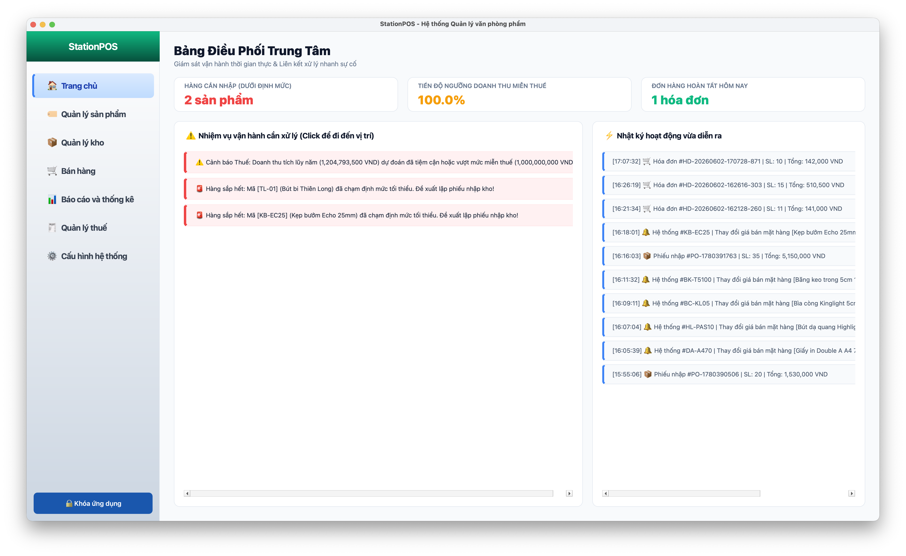
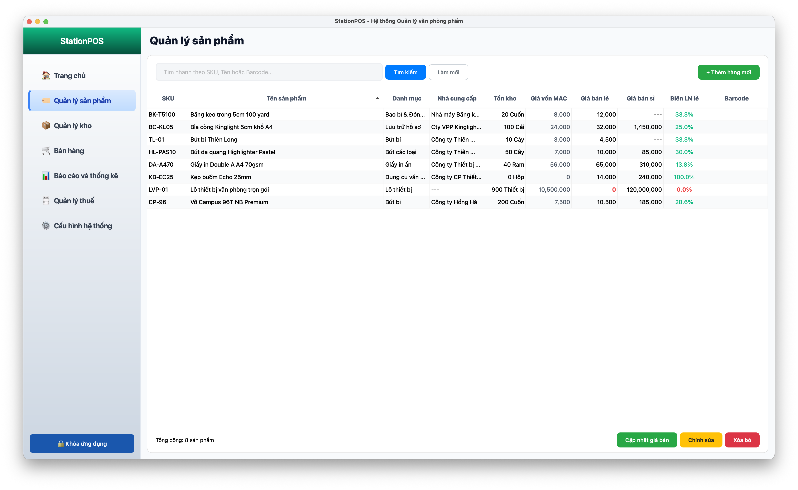
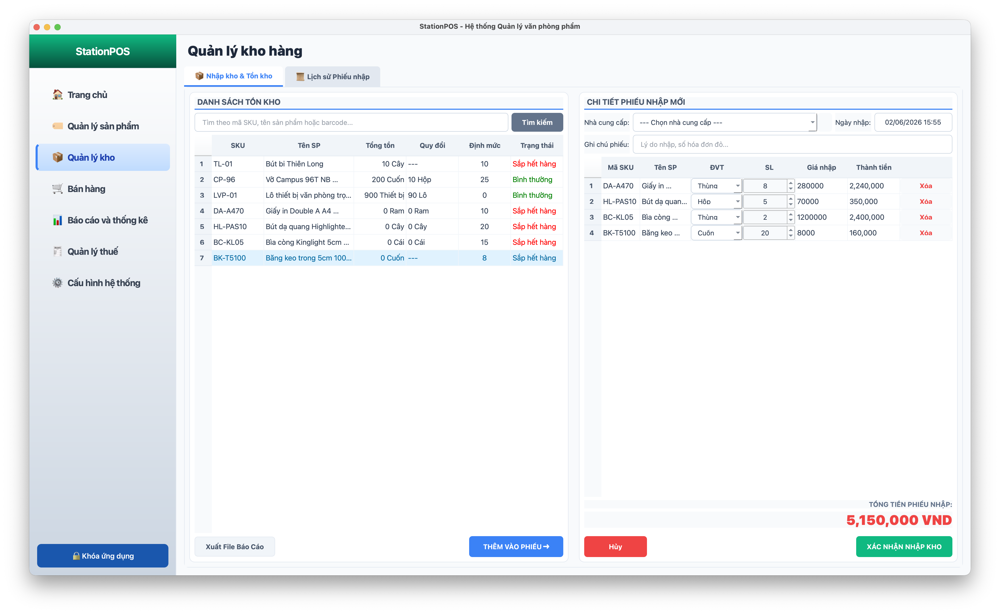
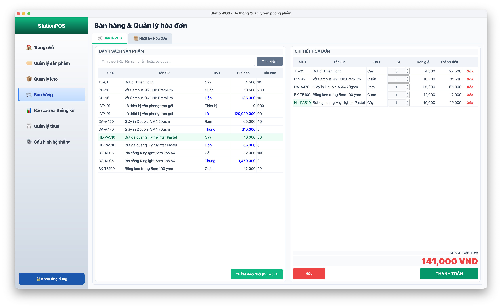
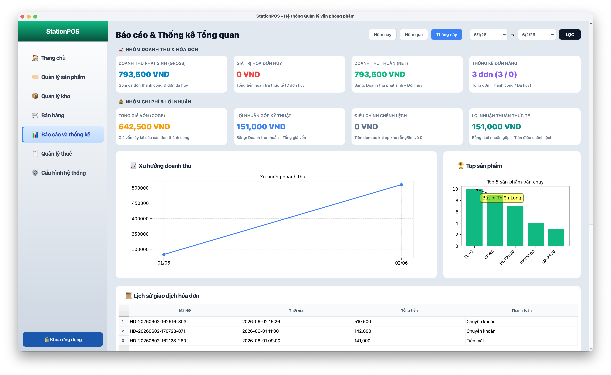
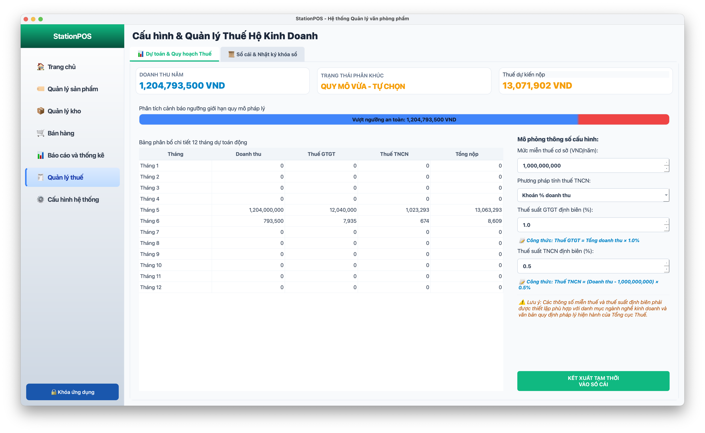
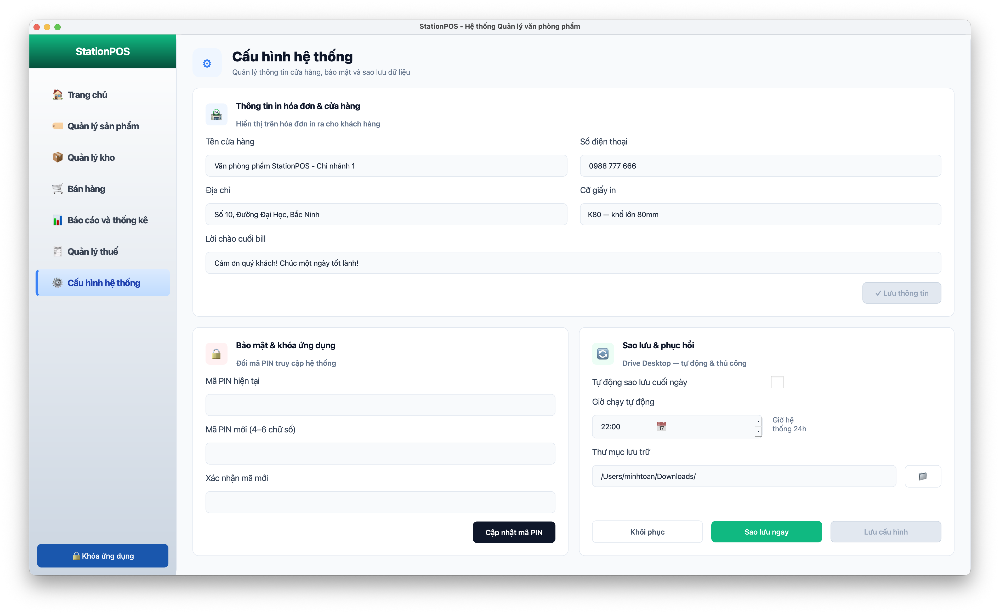

# StationPOS - Phần Mềm Quản Lý Cửa Hàng Văn Phòng Phẩm

**StationPOS** là phần mềm quản lý bán hàng và kho vận cho mô hình bán lẻ văn phòng phẩm dưới dạng ứng dụng Desktop. Được xây dựng hoàn toàn trên nền tảng **Python thuần (Pure Python) cốt lõi và không sử dụng các framework back-end**, dự án tập trung giải quyết các bài toán thực tế khắt khe trong ngành kế toán - tài chính kho từ cấp độ thuật toán gốc, tuân thủ nghiêm ngặt các nguyên lý kỹ nghệ phần mềm và pháp lý hiện hành.

---

## 📈 Điểm Sáng Nghiệp Vụ (Business Logic)

Dự án đi sâu giải quyết 5 bài toán nghiệp vụ cốt lõi:

1. **Bài toán Đơn vị tính đa cấp (Multi-Level UOM):**
* **Thách thức:** Hàng hóa nhập vào theo lô/thùng/hộp với chiết khấu sỉ nhưng rạch lẻ bán theo cái/cuốn, làm phức tạp hóa việc tính giá vốn gốc.


* **Giải pháp:** Áp dụng triết lý **"Chỉ nhìn Tổng"**. Hệ thống cho phép cấu hình tỉ lệ quy đổi (`ratio`) linh hoạt ở tầng hiển thị, nhưng dưới tầng xử lý kho (Back-end), mọi số lượng được quy đổi về đơn vị cơ bản nhỏ nhất. Hệ thống hấp thụ khoản sỉ bằng 2 tham số: *Tổng số lượng cơ bản* và *Tổng tiền thực trả trên hóa đơn* để tính toán giá vốn chính xác.


2. **Khử sai số "Rác Thập Phân" trong hạch toán kho:**
* **Thách thức:** Phép chia liên tục khi tính toán Giá vốn bình quan di động (MAC) sinh ra số thập phân vô hạn, dẫn đến tích tụ sai số làm tròn thành "rác tài sản" (kho vật lý đã hết về 0 nhưng tổng giá trị tiền tồn đọng vẫn lệch vài đồng lẻ).


* **Giải pháp:** Khi số lượng tồn kho chạm về 0, hệ thống tự động ép giá trị kho về 0.0000đ tuyệt đối. Đồng thời, hệ thống tự động sinh bút toán đối ứng điều chỉnh chênh lệch `DATA_CORRECTION` hoặc `ADJUST_VARIANCE` mang dấu âm để triệt tiêu hoàn toàn rác làm tròn, làm sạch sổ cái kế toán.


3. **Chốt Giá vốn Lịch sử (Snapshot COGS):**
* **Thách thức:** Giá vốn MAC biến động liên tục sau mỗi lần nhập kho. Tính lợi nhuận gộp cuối kỳ bằng cách lấy giá vốn hiện tại nhân cho số lượng đã bán trong quá khứ sẽ gây sai lệch hoàn toàn báo cáo tài chính.


* **Giải pháp:** Tuân thủ nghiêm ngặt *Nguyên tắc phù hợp (Matching Principle)* trong kế toán. Tại đúng tích tắc phát sinh đơn hàng bán, hệ thống thực hiện "chụp ảnh" cố định thông số giá vốn hàng bán (COGS) tại thời điểm đó và ghi cứng trực tiếp vào từng dòng của hóa đơn. Mọi biến động giá nhập ở tương lai hoàn toàn không làm ảnh hưởng đến dữ liệu lợi nhuận trong quá khứ.


4. **Kiểm soát Luồng Đảo Ngược (Hủy phiếu / Trả hàng):**
* **Thách thức:** Hủy một phiếu nhập cũ sau khi đã phát sinh các giao dịch xuất bán lẻ phía sau sẽ làm biến dạng và phá vỡ giá vốn đã hòa trộn (MAC).


* **Giải pháp:** Thiết lập chốt chặn thời gian bảo vệ lịch sử (Timeline Guard). Khi hủy phiếu nhập, hệ thống quét dòng thời gian giao dịch; nếu phát hiện đã có giao dịch xuất kho (`SALE`) phát sinh sau thời điểm nhập của phiếu này, hệ thống sẽ chặn đứng hành vi hủy và gợi ý chuyển sang luồng Trả hàng NCC. Khi khách trả hàng, hệ thống thu hồi vốn theo tỷ lệ phân bổ: `refund_cogs = ROUND((return_qty / sold_qty) * total_cogs_amount)` để pha loãng ngược lại vào kho chính xác.


5. **Số hóa Chính sách Thuế Hộ Kinh Doanh 2026:**
* **Thách thức:** Quản lý thuế theo cơ chế tự kê khai và nộp thuế mới của năm tài chính 2026.


* **Giải pháp:** Cập nhật chính xác quy định pháp lý theo **Nghị định 141/2026/NĐ-CP** (nâng ngưỡng miễn thuế lên 1 tỷ đồng/năm). Hệ thống tự động phân loại quy mô doanh thu, xử lý công thức thuế suất (GTGT 1%, TNCN 0.5%) rẽ nhánh theo thời gian thực và cung cấp chức năng đóng băng dữ liệu "Khóa sổ kỳ thuế năm" bằng mã PIN.


---

## 🛠️ Giải Pháp Kỹ Thuật & Kiến Trúc (Technical Design)

### 1. Kiến Trúc Phân Lớp (Layered Architecture)

Hệ thống bóc tách mã nguồn thành 4 tầng kiến trúc tách biệt để tăng khả năng bảo trì và viết Unit Test:

```text
[Presentation Layer: PyQt6 Views & Controllers]
         │  ▲  (Truyền tải dữ liệu an toàn qua DTOs)
         ▼  │
[Business Logic Layer: Services & Validators]
         │  ▲  (Giao tiếp lỏng qua Interface / ABC)
         ▼  │
[Data Access Layer: Repositories & Unit of Work]
         │  ▲  (Quản lý Transaction tập trung, bảo đảm tính ACID)
         ▼  │
[Infrastructure Layer: MySQL Database & Database Views]

```

### 2. Quản lý Giao dịch với Unit of Work (UoW)

* Mọi nghiệp vụ quan trọng (Nhập kho: tạo phiếu + cộng tồn kho + ghi log; Bán hàng: tạo hóa đơn + trừ kho + lưu giá vốn snapshot) đều được bọc chặt trong một khối giao dịch **ACID Transaction**.


* Sử dụng context manager (`with UnitOfWork() as uow:`) kiểm soát chu kỳ sống của kết nối, tự động gọi `commit()` khi chuỗi thao tác thành công hoặc `rollback()` ngay lập tức khi xảy ra bất kỳ ngoại lệ (Exception) nào để bảo vệ an toàn dữ liệu.


### 3. Chống Tranh Chấp Dữ Liệu (Race Condition)

* Nhằm phục vụ định hướng mở rộng mô hình đa quầy thu ngân trong tương lai, hệ thống áp dụng kỹ thuật khóa dòng dữ liệu **Pessimistic Locking (`SELECT ... FOR UPDATE`)** trong MySQL ngay khi bắt đầu tiến trình kiểm tra tồn kho.


* Mọi luồng thanh toán trùng mặt hàng bắt buộc phải xếp hàng tuần tự xử lý, loại bỏ 100% rủi ro bất đồng bộ hoặc gây âm kho ngoài ý muốn. Nếu vượt quá tồn kho hiện tại, hệ thống lập tức ném lỗi `ValidationException` để dừng và hoàn tác nghiệp vụ.


### 4. Chiến Lược Kiểm Thử Tự Động (Testing Strategy)

* Ứng dụng bộ ba thư viện mở rộng: `pytest`, `pytest-qt` (giả lập hành vi nhập liệu, tương tác UI của người dùng) và `pytest-qt` / `pytest-mock` (giả lập phản hồi từ CSDL).


* Kiểm thử cô lập hoàn toàn môi trường giúp kiểm tra sâu các luồng nghiệp vụ thông thường (Happy path), các ca phá hoại dữ liệu (Unhappy path) và các ca kiểm thử biên (Edge cases) mà không sinh dữ liệu rác trong CSDL vận hành thật.


---

## 🌟 Chức Năng (Features & Achievements)

Ứng dụng tối ưu hóa trải nghiệm trên một khung hiển thị cố định Single-Window (1400x900px), chuyển đổi nhanh thông qua thanh Sidebar điều hướng lật trang `QStackedWidget` gồm 7 nhóm chức năng:

* **Bảng Điều Phối Trung Tâm (Dashboard):** Giám sát thời gian thực các KPI động (Số lượng hàng cần nhập dưới định mức, tiến độ đạt ngưỡng doanh thu miễn thuế, tổng hóa đơn hoàn tất trong ngày). Tích hợp cơ chế **Deep-linking** (Click vào dòng cảnh báo khẩn cấp tự động chuyển sang module đích và điền sẵn bộ lọc tìm kiếm).
* **Minh họa giao diện:**
  <p align="center">
    
  </p>


* **Quản Lý Danh Mục Sản Phẩm:** Quản lý hàng hóa dựa trên mã SKU và Barcode 13 số độc nhất. Hỗ trợ chức năng **Xóa mềm (`is_active = FALSE`)** giúp ẩn sản phẩm khỏi quầy bán nhưng giữ nguyên thực thể cấu trúc trên hóa đơn cũ và báo cáo để bảo toàn tính toàn vẹn dữ liệu tài chính.
* **Minh họa giao diện:**
  <p align="center">
    
  </p>


* **Quản Lý Kho & Nhập Hàng:** Lập phiếu nhập sỉ theo đơn vị quy đổi, tự động tính toán lại MAC. Hỗ trợ hủy phiếu nhập lỗi (trừ ngược kho và hoàn tác MAC an toàn). Kết xuất báo cáo tồn kho ra file `.xlsx` vật lý tự động bôi màu vàng nhận diện các mặt hàng sắp hết.
* **Minh họa giao diện:**
  <p align="center">
    
  </p>


* **Giao Diện Bán Hàng POS:** Tự động tách hiển thị sản phẩm theo ĐVT sỉ/lẻ dựa trên tồn kho thực tế giúp thu ngân chọn bán nhanh. Bộ tính toán hiển thị live số tiền thừa trả khách. Xử lý bọc lưu hóa đơn và tạo Snapshot COGS an toàn.
* **Minh họa giao diện:**
  <p align="center">
    
  </p>


* **Báo Cáo & Thống Kê Tài Chính:** Tổng hợp nhóm Doanh thu thuần và nhóm Lợi nhuận thuần thực tế thực nhận (sau khi cộng/trừ đi giá trị điều chỉnh chênh lệch rác kho). Nhúng trực tiếp Canvas của thư viện đồ họa vẽ biểu đồ đường xu hướng doanh thu và biểu đồ cột Top 5 sản phẩm bán chạy.
* **Minh họa giao diện:**
  <p align="center">
    
  </p>


* **Dự Toán Nghĩa Vụ Thuế:** Theo dõi doanh thu tích lũy cả năm. Thanh tiến trình `QProgressBar` tự động đổi màu sắc thị giác cảnh báo: Màu xanh (Dưới ngưỡng an toàn) và Màu đỏ (Khi doanh thu vượt ngưỡng 1 tỷ đồng/năm, lập tức hiển thị chi tiết nghĩa vụ thuế cần nộp của 12 tháng).
* **Minh họa giao diện:**
  <p align="center">
    
  </p>


* **Bảo Mật & Cấu hình:** Quản lý thông cửa hàng in trên hóa đơn, tùy chỉnh linh hoạt khổ giấy (K80/K58), thay đổi mã PIN quản trị, khôi phục và sao lưu dữ liệu.
* **Minh họa giao diện:**
  <p align="center">
    
  </p>


### Điểm hạn chế

* **Kiến trúc đơn chủ cục bộ:** Phần mềm hiện tại mới chỉ thiết kế chạy Offline cho kịch bản một người vận hành duy nhất (Chủ cửa hàng), chưa hỗ trợ đa máy trạm đồng thời và chưa phân quyền vai trò chuyên sâu (Thu ngân, Thủ kho, Quản lý).


* **Giả lập tương tác thiết bị vật lý:** Các nghiệp vụ tương tác phần cứng tại quầy mới dừng ở mức xử lý dữ liệu và giả lập hệ thống (Lệnh in bill kết nối Driver máy in mô phỏng), chưa độc lập nhận tín hiệu trực tiếp từ máy quét mã vạch cổng COM hay két tiền tự động nhảy.


* **Phụ thuộc tiến trình đồng bộ Cloud:** Tiến trình sao lưu đám mây ngầm vẫn phụ thuộc vào folder đồng bộ cục bộ của phần mềm ứng dụng bên thứ ba (OneDrive/Google Drive Desktop) lưu trên máy tính chứ chưa tích hợp gọi trực tiếp Cloud API.


### Định hướng phát triển tương lai

* Tách biệt hệ thống lên mô hình Client-Server: Phát triển tầng Backend API (FastAPI/Django) kết hợp cơ sở dữ liệu Cloud (PostgreSQL) và giao diện Web/Mobile (ReactJS/Flutter) phục vụ quản lý từ xa chuỗi cửa hàng.


* Tích hợp API ngân hàng tự động sinh mã VietQR động chứa chính xác số tiền cần trả cho từng hóa đơn POS và tự động hoàn tất đơn khi khách chuyển khoản thành công.


* Xây dựng hệ thống API kết nối trực tiếp với Tổng cục Thuế để xuất hóa đơn điện tử tự động ngay khi in bill.
* Ứng dụng các mô hình Machine Learning cơ bản (Time-series) dựa trên lịch sử hóa đơn tiêu thụ quá khứ để đưa ra kế hoạch gợi ý nhập kho tự động trước khi hàng chạm đáy định mức tối thiểu.


---

## 💻 Công Nghệ Sử Dụng (Tech Stack)

* **Ngôn ngữ lập trình:** Python 3.11+


* **Giao diện đồ họa (GUI):** PyQt6 (Nạp động layout XML qua Qt Designer, định kiểu giao diện bằng QSS phẳng).


* **Cơ sở dữ liệu:** MySQL Server (Giao tiếp thuần qua Driver `mysql-connector-python`).


* **Xử lý số liệu & Đồ thị:** NumPy & Matplotlib (Tổ chức mảng dữ liệu tài chính cấu trúc cao và vẽ đồ thị nhúng trực tiếp).


* **Kết xuất báo cáo:** OpenPyXL (Tự động tạo luồng dữ liệu, căn biên và ghi tệp Excel 2010 cấu trúc lớn).


* **Môi trường kiểm thử:** `pytest`, `pytest-qt` (Giả lập hành vi click/nhập liệu người dùng trên UI) và `pytest-mock`.


---

## 📂 Cấu Trúc Thư Mục Dự Án (Project Structure)

```text
station-pos/
├── app/                            # Thư mục mã nguồn chính của ứng dụng
│   ├── core/                       # Thành phần cốt lõi hệ thống (Dùng chung toàn bộ app)
│   │   ├── config/                 # Cấu hình hệ thống, đọc biến môi trường
│   │   ├── database/               # Kết nối CSDL, quản lý Session/Giao dịch (Unit of Work...)
│   │   └── exceptions/             # Định nghĩa các ngoại lệ nghiệp vụ toàn cục (ValidationError...)
│   ├── modules/                    # Nơi chia nhỏ dự án theo từng Tính năng/Nghiệp vụ cốt lõi
│   │   ├── dashboard/              # Ví dụ bố cục phân tách module nội bộ:
│   │   │   ├── dtos/               # Đối tượng đóng gói dữ liệu truyền giữa các tầng
│   │   │   ├── repositories/       # Tầng thực thi câu lệnh SQL thô tương tác trực tiếp bảng
│   │   │   ├── services/           # Tầng chứa logic nghiệp vụ cốt lõi, thẩm định dữ liệu
│   │   │   ├── ui/                 # Bộ điều khiển Controller và giao diện PyQt6 sinh tự động
│   │   │   └── utils/              # Định dạng văn bản, bộ tính toán tiện ích riêng phục vụ module
│   │   ├── inventory/              # Module Quản lý kho, lập phiếu và tính MAC lùi
│   │   ├── main_window/            # Module Cửa sổ chính điều hướng Sidebar trái QListWidget
│   │   ├── product/                # Module Quản lý danh mục hàng hóa, đơn vị quy đổi lẻ/sỉ
│   │   ├── report/                 # Module Báo cáo đồ thị tài chính tổng hợp
│   │   ├── sale/                   # Module Quầy bán lẻ POS thu ngân và Nhật ký hóa đơn
│   │   ├── setting/                # Module Cấu hình shop, đổi PIN bảo mật, phục hồi dữ liệu
│   │   └── tax/                    # Module Quản lý và phân bổ dự toán kỳ Thuế hộ kinh doanh
│   ├── tests/                      # Hệ thống kịch bản kiểm thử tự động (Unit & Integration tests)
│   └── main.py                     # Điểm chạy đầu vào ứng dụng kiểm tra kết nối Fail-Fast
├── database/                       # Script kịch bản khởi tạo cấu trúc dữ liệu vật lý (schema.sql, schema_test.sql)
├── venv/                           # Thư mục môi trường ảo cô lập dự án
├── .env                            # Lưu trữ biến môi trường cấu hình thông số kết nối MySQL bảo mật
├── .gitignore                      # Khai báo loại bỏ các tệp tin cục bộ, mã bảo mật khi đẩy lên Git
├── pytest.ini                      # Tệp tin cấu hình đường dẫn hệ thống pythonpath cho framework test
├── requirements.txt                # Danh sách thư viện Python phụ thuộc kèm phiên bản cấu hình chuẩn
└── README.md

```

---

## 🚀 Hướng Dẫn Cài Đặt & Khởi Chạy

### Bước 1: Khởi tạo cấu trúc Cơ sở dữ liệu

1. Khởi động dịch vụ MySQL Server trên máy tính (Thông qua XAMPP, Docker hoặc dịch vụ Local Services).
2. Sử dụng Terminal để thực thi script cấu trúc nền tảng cho database chạy thật (`pos_vpp`):

```bash
mysql -u root -p < database/schema.sql

```

3. Nếu muốn chạy được test, sử dụng Terminal để thực thi script cấu trúc nền tảng cho database test (`pos_vpp_test`) giống hệt database chạy thật:

```bash
mysql -u root -p < database/schema_test.sql

```


### Bước 2: Thiết lập Biến môi trường bảo mật

Tạo một file có tên chính xác là `.env` nằm ngay tại thư mục gốc của dự án (`station-pos/`) và điền thông số tài khoản MySQL cục bộ:

```text
DB_HOST=localhost
DB_USER=your_mysql_user_here
DB_PASSWORD=your_mysql_password_here
DB_DATABASE=pos_vpp
DB_NAME_TEST=pos_vpp_test

```

### Bước 3: Khởi tạo Môi trường ảo và cài đặt thư viện

Mở Terminal tại thư mục gốc dự án và thực thi chuỗi lệnh sau để cô lập môi trường lập trình:

```bash
# Tạo môi trường ảo Python
python -m venv venv

# Kích hoạt môi trường ảo (Đối với Windows)
venv\Scripts\activate

# Kích hoạt môi trường ảo (Đối với macOS/Linux)
source venv/bin/activate

# Cài đặt đồng bộ toàn bộ thư viện bắt buộc phụ thuộc
pip install -r requirements.txt

```

### Bước 4: Vận hành khởi chạy ứng dụng

Thực thi lệnh Python gọi module hệ thống tại thư mục gốc để mở phần mềm:

```bash
python -m app.main

```

> 🔑 **Mã PIN bảo mật mặc định:** Mã bảo vệ ban đầu để vượt qua chốt chặn màn hình khóa ứng dụng là `1234`, có thể thay đổi mã PIN quản trị này trực tiếp tại module Cấu hình hệ thống.

---

## 🧪 Hướng Dẫn Chạy Kiểm Thử Tự Động (Automation Testing)

Dự án tích hợp đầy đủ các kịch bản kiểm thử biên toàn diện tại thư mục `app/tests/`. Hệ thống sử dụng file `conftest.py` để tự động dọn sạch và lập môi trường Database thử nghiệm độc lập (Tên DB lấy theo key `DB_NAME_TEST` trong file `.env`), cam kết quá trình chạy kiểm thử không làm ảnh hưởng hay sinh dữ liệu rác vào bảng vận hành thật của cửa hàng.

Để kích hoạt bộ máy kiểm thử tự động, thực thi lệnh sau tại Terminal:

```bash
# Chạy toàn bộ các ca Unit Test và Integration Test hệ thống
pytest

# Chạy kiểm thử chế độ chi tiết (Verbose) in rõ ràng mốc tiến độ logic ra màn hình
pytest -v

```

